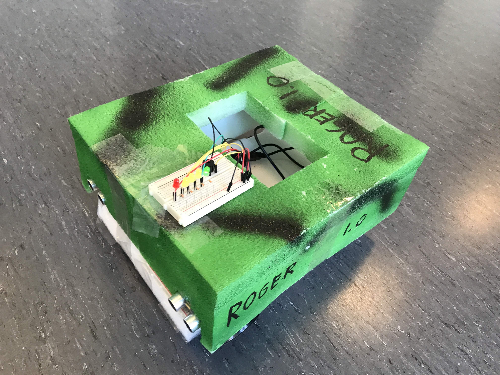
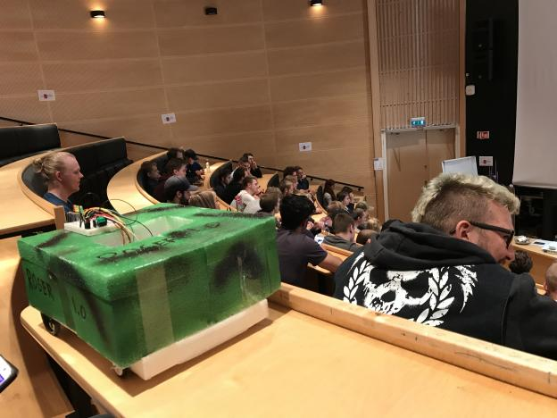

Original code from the award-winning project ROGER 1.0

## Oppsett

Plasser alle filer i `libraries/` i arduino library mappa. 

Guide: http://www.arduino.cc/en/Guide/Libraries

Deretter skal du kunne åpne `roger.ino` i Arduino IDE, kompilere og laste opp koden til arduino.

Pins som brukes er notert som variabler på toppen av `roger.ino`.

